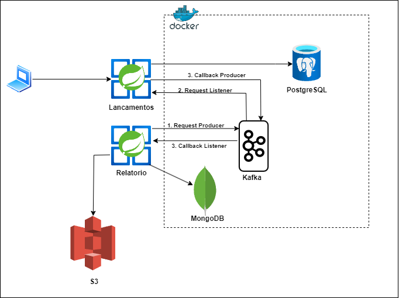

# Comercio - Lançamentos
_Projeto para teste em processo seletivo_.

Esse projeto ilustra um comercio que precisa controlar o seu fluxo de caixa diário com os lançamentos 
(débitos e créditos), também precisa de um relatório que disponibilize o saldo diário consolidado.

Esse projeto é um micro-servico que tem integracao com o micro-servico de [Comercio - Relatorio](https://github.com/jorgekamezawa/comercio-relatorio)

## Tecnologias

- **Java 17**
- **Spring Boot 2.7.12**
- **Gradle**
- **Docker**
- **PostgreSQL**
- **MongoDB**
- **Kafka**
- **AWS S3**

## Arquitetura
##



## Excecucao do Projeto

**Para executar o projeto siga os seguintes passos:**

1. Clone esse projeto na sua maquina:
```shell
cd "diretorio de sua preferencia"
git clone https://github.com/jorgekamezawa/comercio-lancamento.git
```
2. Ter instalado o **JDK 17:**
```
https://www.oracle.com/java/technologies/javase/jdk17-archive-downloads.html
```
3. Instalar e executar o **Docker:**
```
https://www.docker.com/
```
4. Subir os containers do **PostgreSQL, KAFKA e MongoDB:**
```shell
cd "diretorio raiz desse projeto"
docker-compose up -d
```
